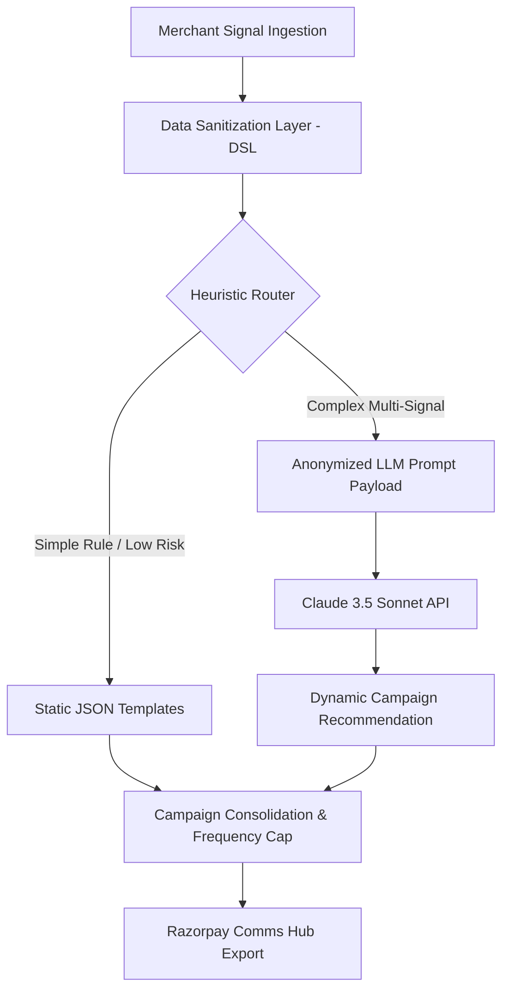

# PRODUCT REQUIREMENTS DOCUMENT
## Merchant Activation IQ (MAIQ)
*An AI-powered SME merchant activation, retention & monetisation platform*

| Metadata | Value |
| :--- | :--- |
| **Product Name** | Merchant Activation IQ (MAIQ) |
| **Author** | Saurabh Chawda — Candidate, Senior PM (Growth), Razorpay |
| **Reviewer** | Rohan Mehta — Director of Product, Growth · Razorpay |
| **Framework** | STEP (Scope → Target → Experiment → Prove) |
| **Version** | v1.1 (Revised based on Design & Eng feedback) |
| **Status** | Draft — for Executive Review |

---

## STEP 1: Clarifying Questions & Scope Assumptions

*   **Q1: Business Context** - Built on top of Razorpay's existing SME merchant dashboard and data infrastructure. Not a greenfield product.
*   **Q2: Constraints** - 2-week MVP timeline for the prototype (FastAPI + React). Full internal production target is a 4-week sprint (1 PM, 2 FE, 1 BE, 1 Analyst).
*   **Q3: Internal vs. External** - Internal PM tool for the Growth squad, outputting campaigns that surface directly to merchants.
*   **Q4: Data Privacy & Access** - Simulates realistic synthetic data. Production requires VPC compliance.
*   **Q5: Out of Scope** - Core KYC verification, payment gateway core checkouts, paid marketing, and Enterprise segment.

---

## STEP 2: Goal & Goal Decomposition

**North Star Goal:** Increase SME merchant activation rate (first live transaction within 7 days) and 90-day retention to drive platform GMV.

### Goal Decomposition
*   **Business Goal:** Increase 90-day SME merchant GMV contribution by 15% (Q2).
*   **Product Goal:** Lift merchant activation rate (first transaction in D7) from 45% to 65% in 6 months.
*   **Retention Goal:** Reduce 30-day merchant churn from 35% to 22%.

---

## STEP 3: User Segmentation (Behavior-based)

1.  **Segment A: Registered Non-Activator (RNA) [Primary Focus]**
    *   *Signal:* 0 transactions in 7 days post-signup, incomplete bank link/integration.
    *   *Volume:* ~30-35% of signups.
2.  **Segment B: Single-Transaction Merchant (STM)**
    *   *Signal:* Exactly 1 transaction, inactive for 14+ days.
3.  **Segment C: Growing Merchant (GM)**
    *   *Signal:* 5-50 transactions/month, growing MoM. Target for monetisation features.

---

## STEP 4: User Pain Points (RNA Segment)

1.  **Integration Paralysis:** Non-technical merchants get stuck on API keys/code setups.
2.  **No First Success Moment:** The absence of a designed "aha!" moment (e.g., getting the first test payment link paid by themselves).
3.  **Reactive Outreach:** Interventions fire too late (e.g., 7 days after signup instead of when the merchant drops off mid-funnel).

---

## STEP 5: Solutions & Architecture Refinements

Based on the Product Trio review, the architecture has been revised to address security, cost, and design loopholes.

### Revised Solution 2: MAIQ + Hybrid Intervention Recommender (MVP Scope)

#### 🛡️ Data Sanitization Layer (DSL) [Engineering Requirement]
To comply with DPDP and Razorpay security guidelines, all merchant data is tokenized prior to reaching external APIs:
*   `merchant_id` is hashed using SHA-256.
*   All PII (names, emails, phone numbers) are stripped.
*   Business names are mapped to standardized categories (e.g., "Fashion Retailer" instead of "Raj's Saree Palace").

#### 💸 Hybrid Heuristic Router (Cost & Rate Control) [Engineering Requirement]
*   **Rule Engine:** Linear, time-based, or simple state drop-offs (e.g., "KYC rejected, no action for 24h") bypass the LLM and fetch static campaign templates immediately. Saves ~70% of LLM costs.
*   **LLM Engine:** Used only for complex behavioral patterns (e.g., "Logged in 3 times, visited API docs, created payment link, but 0 transactions for 5 days").

#### 🎨 Brand & Frequency Guardrails [Design Requirement]
*   **Brand Voice:** LLM prompt system instructions strictly enforce Razorpay's tone guide (helpful, technical-but-accessible, professional).
*   **Frequency Cap:** Built-in rule-blocker preventing more than 1 notification campaign per merchant in any 48-hour window.
*   **Campaign Templates:** PMs select from pre-approved templates ("Quick PayLink", "QR Generator"), and the LLM merely customizes the messaging context.

---

## STEP 6: Prioritized Features

1.  **Funnel Visualizer (MVP):** 5-stage onboarding funnel highlighting drop-offs.
2.  **Hybrid Campaign Simulator (MVP):** PMs test static rule-based or dynamic LLM-based interventions.
3.  **Data Sanitizer Simulator (MVP):** Shows the side-by-side view of raw merchant data vs. anonymized LLM input.
4.  **Frequency Cap & Brand Guardrail Checker (MVP):** LLM outputs are checked programmatically for capping and tone.
5.  **Comms Hub Export Payload (MVP):** Generates JSON payloads ready for export to mock comms dispatchers (closing the design loop).
6.  **Jira Export Integration (MVP):** Replaces internal backlog with clean JSON/Markdown Jira ticket specifications.

---

## STEP 7: Success Metrics

### Production Metrics
*   **North Star:** 30-day merchant activation rate (45% → 65%).
*   **Signpost:** Dynamic campaign CTR (>12%), RNA recovery rate (>15%).
*   **Do No Harm:** Merchant unsubscribe rate (<1.5%), LLM API cost (< ₹0.15 per merchant due to Hybrid Router).
