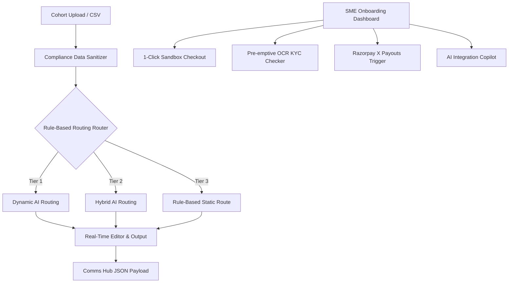

# Merchant Activation IQ (MAIQ) 🚀

[](https://merchant-activation-iq-maiq.vercel.app/)
[](https://github.com/saurabh1chawda/Merchant-Activation-IQ-MAIQ/blob/main/test.js)
[](https://github.com/saurabh1chawda/Merchant-Activation-IQ-MAIQ/blob/main/uat.js)
[](https://github.com/saurabh1chawda/Merchant-Activation-IQ-MAIQ/blob/main/app.js)

MAIQ is an AI-powered growth engineering and campaign management system built on top of Razorpay's SME merchant database. It automates, optimizes, and secures the process of activating registered merchants who have stalled during onboarding (Registered Non-Activators - RNAs).

By employing a hybrid routing system (heuristics + AI), MAIQ generates hyper-personalized communications and supplies a suite of self-serve tools including a zero-risk 1-Click Sandbox Checkout, an OCR KYC Checker, Razorpay X Payouts simulator, and an AI Integration Copilot.

---

## 🗺️ System Architecture

MAIQ uses a hybrid execution protocol to protect merchant PII under the DPDP Act and minimize LLM token expenses:



---

## ✨ Core Features

1.  **Segmented Onboarding Funnel:** Renders the 5 core stages of the SME onboarding lifecycle (Signup, KYC, Bank Link, API integration, Activation). Filters dynamically.
2.  **AI Hybrid Campaign Compiler:** Automatically evaluates cohort rows and routes them to static or dynamic AI generation engines based on revenue tiers.
3.  **1-Click Sandbox Checkout:** A panel allowing users to simulate UPI payments, hear a synthesized payment chime, see confetti bursts, and unlock Tier-scaled rewards.
4.  **Pre-emptive OCR KYC Checker:** Instant client-side validation of PAN/GST documents, detecting blurriness, missing signatures, or name mismatches with 1-click remediation.
5.  **Razorpay X Payouts Trigger:** A dedicated test environment for merchants to simulate fast payouts, restricted until API keys are generated.
6.  **AI Integration Copilot:** A virtual developer assistant that generates API keys, supplies copy-paste code snippets for various tech stacks, and tests localhost webhooks.
7.  **Local Persistence & Sync:** Completed payments, API keys, and KYC status are saved in `localStorage` and automatically update the active merchant's dashboard checklist.

---

## 🚀 Getting Started

### Prerequisites
*   A modern web browser (Chrome, Safari, Firefox, Edge).
*   *Optional:* [Node.js](https://nodejs.org/) (for running the automated test suite).

### Quick Run
1.  Clone this repository:
    ```bash
    git clone https://github.com/saurabhchawda/merchant-activation-iq.git
    ```
2.  Navigate to the repository folder and double-click `index.html` to open it in your browser. No web server or package installs are required!

### Run Automated Tests & UAT
Execute the QA and product verification scripts directly in your shell:
```bash
# Run QA logical assertion tests
node test.js

# Run PM User Acceptance tests
node uat.js
```

---

## 📝 Document Logs & Artifacts
The technical design and verification logs are maintained in the following workspace documentation:
*   [FINAL_PRD.md](file:///c:/Users/saura/OneDrive/Desktop/LIVE%20PROTOTYPES/Razaorpay/FINAL_PRD.md) - Product Requirements (STEP Framework)
*   [USER_GUIDE.md](file:///c:/Users/saura/OneDrive/Desktop/LIVE%20PROTOTYPES/Razaorpay/USER_GUIDE.md) - Operational User Guide
*   [QA_Bugs_Report.md](file:///C:/Users/saura/.gemini/antigravity/brain/4586bc15-f5ef-4e6b-80e4-5e069829849f/QA_Bugs_Report.md) - QA Crucible Certification
